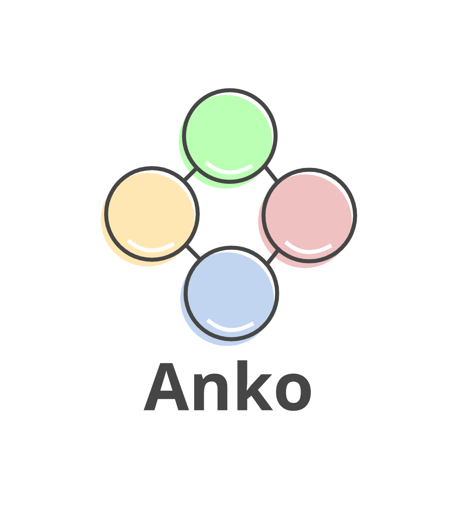

# Anko
> Simple Application watcher

 [](https://img.shields.io/badge/License-Apache%202.0-yellow) [](https://goreportcard.com/report/github.com/GuilhermeCaruso/anko) [](https://travis-ci.com/GuilhermeCaruso/anko) [](https://codecov.io/gh/GuilhermeCaruso/anko)

<p >
  
</p>

The Anko project aims to be a command line used to watch files of different extensions, executing actions previously configured, such as, restart, deletion, execution of scripts, among others.

The project so far has the following functionalities:

- Definition of execution language. [List of implemented languages](#implemented-languages-and-commands)
- Declaration of extensions and files for watching.
- Independent configuration file

# Summary

- [Install](#install)
- [Guide](#guide)
  - [Anko File](#anko-file)
- [Example](#example)
- [Implemented Languages and Commands](#implemented-languages-and-commands)
- [OS compatibility](#os-compatibility)
- [To do](#to-do)
- [Author](#author)
- [License](#license)


# Install

### **If you have golang installed**

- To get Anko CLI

```sh
go get -u github.com/GuilhermeCaruso/anko
```

- If you prefer to create your own build using the flags you want, just clone this repository and run the golang build command

```sh
git clone git@github.com:GuilhermeCaruso/anko.git && \
cd anko && \
go <your_flags_here> build  
```

Once with the binary, remember to add it to the system PATH

> If you still don't know how to do it, [read here](https://superuser.com/questions/284342/what-are-path-and-other-environment-variables-and-how-can-i-set-or-use-them)!


### **If you don't have golang isntalled**

Soon we will make available the download the binaries...


# Guide

The anko project was initially developed to observe changes in golang projects and reload it on demand. During development, we noticed that the project could be used for the most diverse languages ​​and technologies (With the help of the community), because of that, it was necessary to add a configuration file, the Anko file

## Anko File

- **Localization**

The Anko file is a `.yaml` file written, preferably, at the root of the project you want to observe, but nothing prevents you from saving it wherever you want.

- **Nomenclature**

The project was developed to avoid as much as possible that the user has to adapt the project to suit him, however, the file name is the only information that must be kept as a standard.

The configuration file name must always be: `anko.yaml`

- **Properties**

> Root

| key | type | description |
|-|-|-|
|`application`| Application | Base of the anko file

> Application

|key |type| description|
|-|-|-|
|`root_path`| string | Path to the directory to be observed
|`exec_ath`| string | Path to application entry point
|`language`| string | Execution language. Check [here](#implemented-languages-and-commands) if your favorite language has already been implemented
|`watch`| Watch | List of files and extensions to be observed. Initially only update events

> Watch

|key |type| description|
|-|-|-|
|`extensions`| []string | List of extensions that must be observed
|`files`| []string | List of files that must be observed


# Example

Below is a simple example of the `anko.yaml` file

> anko.yaml

```yaml
application:
  root_path: "."
  exec_path: "path/to/main.go"
  language: go
  watch:
    extensions: 
      - go
      - env
    files:
      - go.mod
```

Once you have the Anko cli set up, just run the command in the folder containing the `anko.yaml` file.

```sh
anko
```

The initial output should be:

```
> Starting Anko! 
> Configuring watcher. 
> Listening for changes... 
```

# Implemented languages and Commands

The implemented languages and commands ​​allow the angel project to be able to execute the most diverse projects independently and performatively.

Throughout the development and with the help of the community, several languages ​​will be implemented and listed below.


| Command or languages | Anko name | Status |
| - | - | - |
| GO | go | [example](https://github.com/GuilhermeCaruso/anko/tree/main/example/golang)
| NodeJs | node |[example](https://github.com/GuilhermeCaruso/anko/tree/main/example/nodejs)

# OS compatibility

Throughout the development of the project, with its respective versions and builds, compatibility with the most diverse operating systems is validated to ensure that everything is ok.

As it is a project in its initial phase, not all operating systems are being compatible with it, however, with the help of the community and the commitment of the team involved, we hope to mitigate this problem in an agile manner.

Below are listed in a macro manner the tested operating systems and their respective status

| OS | Status |
| - | - |
| Debian | `compatible`
| macOS Big Sur | `compatible`
| Windows 10 | `incompatible`


# To do
- [ ] Add more elaborate commands to the command line
  - [ ] Init
  - [ ] Test
  - [ ] Update
  - [ ] Run
- [ ] Create website for project documentation and news
- [ ] Add OS compatibility
  - [ ] Windows 10
  - [ ] Arch
  - [ ] Fedora
- [ ] Improve the implementation of new languages
- [ ] Add languages or commands compatibility
  - [ ] Makefile
  - [ ] Shellscript
  - [ ] Rust
  - [ ] Lua
  - [ ] Yarn
  - [ ] Npm


# Author

Guilherme Caruso 
- [@GuilhermeCaruso](https://github.com/GuilhermeCaruso) on Github
- [@guicaruso_](https://twitter.com/guicaruso_) on Twitter
- [@guicaruso_](https://instagram.com/guicaruso_) on Instagram

# License

Apache 2.0 licensed. See the LICENSE file for details.